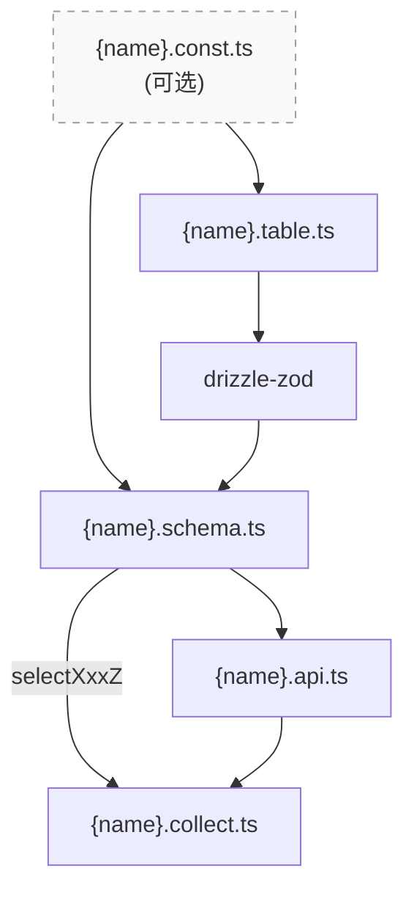

# Drizzle Schema → oRPC → TanStack DB Pattern

## 文件结构与依赖关系

每个 feature 模块通常包含以下文件：



**核心关系**：
- `schema.ts` **主要来源**是 drizzle-zod（从 `table.ts` 生成）
- 部分情况需要从 `const.ts` 导入 zod schema 进行组合（transform、extend 等）
- `const.ts` 同时被 `table.ts`（用于 drizzle enum）和 `schema.ts` 引用

## 文件职责

### `{name}.const.ts` (可选)

提供常量、zod schema 及推断类型。

**设计原则：一份来源，避免重复**

- **简单枚举**：用 `as const` 数组定义，drizzle 和 zod 都可直接使用
- **json 结构**（用于表中的 jsonb 字段）：先在 `.const.ts` 定义 zod schema，再 `z.infer` 导出类型。这样只需写一遍结构，类型和 schema 共用同一来源，避免在 `.table.ts` 写一次类型、在 `.schema.ts` 再写一次 zod

```typescript
import z from 'zod';

// 常量定义 — 用于 drizzle enum，简单的直接用常量，不需要导出 zod
export const friendStatuses = ['pending', 'accepted', 'rejected'] as const;
export type FriendStatus = (typeof friendStatuses)[number];

// 复杂结构 schema — drizzle 中存为 jsonb，需要导出 zod 供 .schema.ts 组合使用
export const messageAttachmentsZ = z.object({
  id: z.string(),
  type: z.enum(['image', 'file']),
  url: z.string(),
}).array();
// 导出类型供 .table.ts 使用
export type MessageAttachments = z.infer<typeof messageAttachmentsZ>;

export const messageReactionsZ = z.object({
  emoji: z.string(),
  userIds: z.array(z.string()),
}).array();
export type MessageReactions = z.infer<typeof messageReactionsZ>;
```

**为什么需要**：drizzle 不能从 zod 得到表结构，只能通过表结构得到 zod。jsonb 字段在 drizzle 中存为 `json`，其对应的 zod schema 需要在 `.const.ts` 中先定义，然后在 `.schema.ts` 中组合使用（transform、extend、作为字段类型等）。

### `{name}.table.ts`

定义 drizzle 表结构。

```typescript
import { pgTable, text, timestamp, uniqueIndex } from 'drizzle-orm/pg-core';
import { nanoidWithTimestamps } from '#/db.helpers';
import { friendStatuses } from '#/features/friend/friend.const';
import { user } from '#/lib/auth/auth.table.ts';

export const friendTable = pgTable(
  'friend',
  {
    ...nanoidWithTimestamps,
    userId: text('user_id')
      .notNull()
      .references(() => user.id, { onDelete: 'cascade' }),
    friendId: text('friend_id')
      .notNull()
      .references(() => user.id, { onDelete: 'cascade' }),
    status: text({ enum: friendStatuses }).default('pending').notNull(),
  },
  (table) => [uniqueIndex().on(table.userId, table.friendId)],
);
```

### `{name}.schema.ts`

从 drizzle 表通过 drizzle-zod 生成 zod schema。这是命名约定的核心：

**命名约定**：
- `select{表名}Z` — select schema，用于 TanStack DB collection 的 `schema` 字段
- `insert{表名}Z` — insert schema
- `{操作}Input` — oRPC 输入验证用，以 `Input` 结尾
- `{表名}Z` — 其他一般 zod schema，以 `Z` 结尾

**drizzle-zod 注意事项**：
1. **默认值丢失**：drizzle-zod 不会保留 drizzle 表的默认值，需要在 `createSelectSchema`/`createInsertSchema` 的第二个参数中手动添加
2. **null vs nullish**：drizzle 中可空字段会得到 `T | null`，通常需要通过 `.nullish()` 转为 `T | null | undefined`
3. **利用 const.ts 的 zod 覆盖**：drizzle 的 `json`/`jsonb` 字段在 drizzle-zod 中默认为 `z.union([...JSON类型联合...])`，通过在 `createSelectSchema` 第二个参数传入 zod schema 可以直接**覆盖**字段 schema（包括 nullability）

```typescript
import { createInsertSchema, createSelectSchema } from 'drizzle-zod';
import { nanoid } from 'nanoid';
import z from 'zod';
import { friendTable, friendRequestTable } from '#/features/friend/friend.table';

// select schema — 用于 TanStack DB
export const selectFriendZ = createSelectSchema(friendTable, {
  id: (s) => s.default(() => nanoid()),
  created_at: (s) => s.default(() => new Date()),
  updated_at: (s) => s.default(() => new Date()),
  nickname: (s) => s.nullish(), // 可空字段用 nullish()
});
export type SelectFriend = z.infer<typeof selectFriendZ>;

// jsonb 字段利用 const.ts 中的 zod schema 覆盖
export const selectMessageZ = createSelectSchema(message, {
  id: (s) => s.default(() => nanoid()),
  channel_id: (s) => s.nullish(),
  room_id: (s) => s.nullish(),
  created_at: (s) => s.default(() => new Date()),
  updated_at: (s) => s.default(() => new Date()),
  is_edited: (s) => s.default(false),
  is_deleted: (s) => s.default(false),
  is_pinned: (s) => s.default(false),
  content_category: (s) => s.default('text'),
  // 直接传入 const.ts 中的 zod schema 覆盖字段（包括 nullability）
  attachments: messageAttachmentsZ,
  mentions: messageMentionsZ,
  reactions: messageReactionsZ,
});
export type SelectMessage = z.infer<typeof selectMessageZ>;

// insert schema — 基于 createInsertSchema（id 等自动生成字段为可选）
const messageInsertZ = createInsertSchema(message, {
  attachments: messageAttachmentsZ,
  mentions: messageMentionsZ,
});

export const sendMessageIn = messageInsertZ.pick({
  channel_id: true,
  room_id: true,
  content: true,
  attachments: true,
  mentions: true,
});
export type SendMessageIn = z.input<typeof sendMessageIn>;

// 更新/删除 — 基于 selectMessageZ（id 为必填）
export const updateMessageIn = selectMessageZ.pick({
  id: true,
  content: true,
});
export type UpdateMessageIn = z.input<typeof updateMessageIn>;

export const deleteMessageIn = selectMessageZ.pick({
  id: true,
});
export type DeleteMessageIn = z.input<typeof deleteMessageIn>;
```

### `{name}.api.ts`

定义 oRPC 路由。使用 schema.ts 导出的类型和 zod schema。

**先定义再导出**，使函数名显式、export 对象干净、减少嵌套深度：

```typescript
import { eq } from 'drizzle-orm';
import { db } from '#/db.server';
import {
	deleteChannelIn,
	insertChannelIn,
	updateChannelIn,
} from '#/features/channel/channel.schema';
import { channelTable } from '#/features/channel/channel.table';
import { generateTxId } from '#/integrations/electric/genTxid';
import { authFn, getAuthFn } from '#/orpc.base';

const selectChannel = getAuthFn.handler(({ context }) =>
	db
		.select()
		.from(channelTable)
		.where(eq(channelTable.owner_id, context.user.id)),
);

const insertChannel = authFn
	.input(insertChannelIn)
	.handler(async ({ input }) =>
		db.transaction(async (tx) => {
			const txid = await generateTxId(tx);
			const [newChannel] = await tx
				.insert(channelTable)
				.values(input)
				.returning();
			return { txid, item: newChannel };
		}),
	);

const updateChannel = authFn
	.input(updateChannelIn)
	.handler(async ({ input }) =>
		db.transaction(async (tx) => {
			const txid = await generateTxId(tx);
			const { id, ...updateData } = input;
			const [updated] = await tx
				.update(channelTable)
				.set(updateData)
				.where(eq(channelTable.id, id))
				.returning();
			return { txid, item: updated };
		}),
	);

const deleteChannel = authFn
	.input(deleteChannelIn)
	.handler(async ({ input }) =>
		db.transaction(async (tx) => {
			const txid = await generateTxId(tx);
			await tx.delete(channelTable).where(eq(channelTable.id, input.id));
			return { txid };
		}),
	);

export const channelApi = {
	select: selectChannel,
	insert: insertChannel,
	update: updateChannel,
	delete: deleteChannel,
};
```

### `{name}.collect.ts`

定义 TanStack DB collections。使用 schema.ts 中的 `selectXxxZ` 作为 schema。

```typescript
import { queryCollectionOptions } from '@tanstack/query-db-collection';
import {
  createCollection,
  createLiveQueryCollection,
  eq,
  type InferCollectionType,
} from '@tanstack/react-db';
import { selectFriendZ } from '#/features/friend/friend.schema.ts';
import { orpc } from '#/orpc._client.ts';

export const friendCollect = createCollection(
  queryCollectionOptions({
    id: 'friend',
    schema: selectFriendZ, // 使用 selectXxxZ
    queryClient: getContextQC(),
    syncMode: 'on-demand',
    ...orpc.friend.select.queryOptions(),
    getKey: (item) => item.id,
    onInsert: async ({ transaction }) => {},
    onUpdate: async ({ transaction }) => {},
    onDelete: async ({ transaction }) => {},
  }),
);
export type FriendRow = InferCollectionType<typeof friendCollect>;

// 工厂对象 — 包含查询构建器/查询选项、乐观更新动作等
export const friendOptions = {
  // 查询构建器 — 返回 LiveQueryCollection，在组件中直接用于订阅
  list: (userId: string) =>
    createLiveQueryCollection((q) =>
      q
        .from({ f: friendCollect })
        .where(({ f }) => eq(f.userId, userId)),
    ),
};
```

## 新增 feature 步骤

1. 创建 `{name}.const.ts`（如果需要常量/共享 zod, enum）
2. 创建 `{name}.table.ts` 定义 drizzle 表
3. 创建 `{name}.schema.ts` 用 drizzle-zod 生成 schema
4. 创建 `{name}.api.ts` 定义 oRPC 路由
5. 在 `src/orpc.ts` 中注册 oRPC 路由
6. 创建 `{name}.collect.ts` 定义 TanStack DB collections
7. 在 `db.schema.ts` 或相关文件中注册新表（如需要）

## 常见模式

### `{name}Options` 工厂对象

将所有查询函数、乐观更新动作等统一放在 `{name}Options` 中，便于查找和使用：

```typescript
export const friendOptions = {
  // 查询函数
  list: (userId: string) =>
    createLiveQueryCollection((q) =>
      q.from({ f: friendCollect }).where(({ f }) => eq(f.userId, userId)),
    ),
  detail: (id: string) =>
    createLiveQueryCollection((q) =>
      q.from({ f: friendCollect }).where(({ f }) => eq(f.id, id)).findOne(),
    ),
};
```

如果需要独立的乐观更新动作，可以单独导出：

```typescript
export const createFriendAction = createOptimisticAction<...>({
  onMutate: (input) => friendCollect.insert(input),
  mutationFn: async (input) => await orpc.friend.insert.call(input),
});
```

### 从 select schema 派生 oRPC 输入

```typescript
export const acceptFriendRequestZ = selectFriendRequestZ.pick({
  id: true,
  receiver_id: true,
});

// 移除需要从 context 获取的字段
export const acceptFriendRequestIn = acceptFriendRequestZ.omit({
  receiver_id: true,
});
```


### 字段选择模式

```typescript
export const userItemFields = {
  id: true,
  name: true,
  username: true,
  image: true,
} as const;

export const userItemZ = selectUserZ.pick(userItemFields);
export type UserItem = z.infer<typeof userItemZ>;
```
